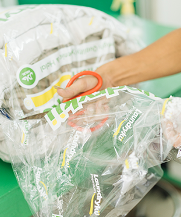
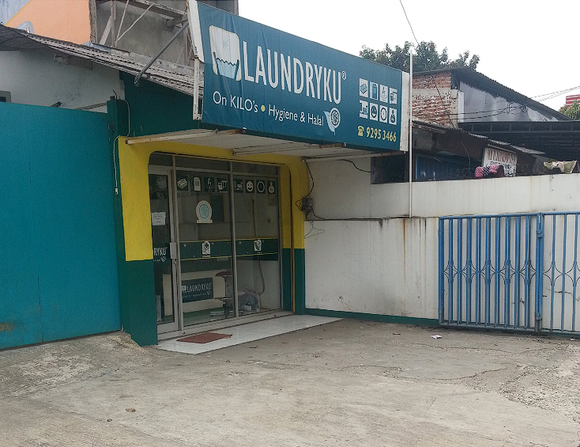

<div align="center">
  
  
  # 🧺 LaundryKu Premium
  
  ### Modern Laundry Service Website with Booking & Tracking System
  
  [](https://laundryku-kappa.vercel.app/)
  [](https://nextjs.org/)
  [](https://www.typescriptlang.org/)
  [](https://tailwindcss.com/)
  [](LICENSE)
  
  *A modern laundry service website with integrated booking and tracking systems*
  
  **🌐 Live Website**: [https://laundryku-kappa.vercel.app/](https://laundryku-kappa.vercel.app/)
  

</div>

---

## 📋 Table of Contents

- [🎯 Project Overview](#-project-overview)
- [✨ Features](#-features)
- [📅 Booking System](#-booking-system)
- [📊 Tracking System](#-tracking-system)
- [🚀 Getting Started](#-getting-started)
- [🛠️ Tech Stack](#️-tech-stack)
- [📱 Screenshots](#-screenshots)
- [🎨 Design System](#-design-system)
- [📦 Installation](#-installation)
- [🔧 Configuration](#-configuration)
- [📄 License](#-license)
- [🤝 Contributing](#-contributing)
- [📞 Contact](#-contact)

---

## 🎯 Project Overview

This is a **modern laundry service website** built with Next.js 14 and TypeScript, featuring integrated booking and tracking systems. The project showcases a complete laundry service platform with enhanced UI/UX, real-time order tracking, and comprehensive booking management.

### 🎨 **Key Features**
- **Modern Design System** - Complete visual overhaul with premium laundry branding
- **Integrated Booking System** - 4-step booking process with location validation
- **Real-time Tracking** - Order status tracking with timeline visualization
- **Enhanced User Experience** - Improved navigation and interactive elements
- **Mobile-First Approach** - Fully responsive design for all devices
- **Performance Optimization** - Fast loading times and smooth animations
- **Security Enhancement** - Advanced anti-inspect and privacy protection features

### 🌐 **Live Demo**
- **Website**: [https://laundryku-kappa.vercel.app/](https://laundryku-kappa.vercel.app/)
- **Booking System**: [https://laundryku-kappa.vercel.app/booking](https://laundryku-kappa.vercel.app/booking)
- **Tracking System**: [https://laundryku-kappa.vercel.app/tracking](https://laundryku-kappa.vercel.app/tracking)
- **Deployed on**: Vercel
- **Status**: Live and fully functional
- **UI/UX Designer Portfolio**: [https://hilmiportfoliodev.vercel.app/](https://hilmiportfoliodev.vercel.app/)

### 📝 **Disclaimer**
This is a redesign project for educational and portfolio purposes. All content, branding, and business information belong to **LaundryKu Premium**. This project demonstrates modern web development practices and design implementation.

### 🎓 **Study Case Project**
This redesign is part of **BootCamp Dibimbing Chapter 41** study case, where I was tasked with redesigning the LaundryKu Premium website to enhance my UI/UX Design skills and showcase modern design practices.

#### 📚 **About BootCamp Dibimbing**
- **Program**: UI/UX Design Bootcamp
- **Chapter**: 41 - Advanced UI/UX Design Session
- **Objective**: Redesign existing website with modern UI/UX principles
- **Focus**: User Experience Design, Visual Design, Responsive Design, and Modern Web Technologies

### 🔄 **What's Different from Original**
- **Modern Tech Stack**: Next.js 14, TypeScript, Tailwind CSS
- **Enhanced UI/UX**: Improved design system and user experience
- **Booking System**: Complete 4-step booking process with location validation
- **Tracking System**: Real-time order tracking with timeline
- **Advanced Features**: Anti-inspect protection, loading animations
- **Better Performance**: Optimized images and code structure
- **Mobile-First**: Fully responsive design approach
- **Design-Focused**: Prioritizing user experience and visual design principles

---

## ✨ Features

### 🎯 Core Features
- **Modern Responsive Design** - Works perfectly on all devices
- **Scroll-triggered Animations** - Smooth reveal animations on scroll
- **Interactive Elements** - Hover effects and micro-interactions
- **Loading Screen** - Beautiful branded loading experience
- **SEO Optimized** - Meta tags and structured data
- **Anti-Inspect Protection** - Advanced security to prevent developer tools access
- **Privacy Protection** - Comprehensive measures to protect website content
- **Performance Optimized** - Fast loading with optimized images and code

### 📅 **Booking System Features**
- **4-Step Booking Process** - Streamlined booking experience
- **Service Selection** - Multiple laundry services with pricing
- **Location Validation** - Google Maps integration with area restrictions
- **Pickup Scheduling** - Date and time selection with availability
- **Customer Information** - Comprehensive customer data collection
- **Area Restrictions** - Pickup service limited to Jakarta Selatan & Tangerang Selatan
- **Real-time Validation** - Instant feedback on form inputs
- **Booking Confirmation** - Success notifications and redirects

### 📊 **Tracking System Features**
- **Order Search** - Search by order number and phone number
- **Real-time Status** - Live order status updates
- **Timeline Visualization** - Step-by-step order progress
- **Order Details** - Comprehensive order information display
- **Contact Integration** - Direct WhatsApp and phone contact
- **Demo Data** - Testing functionality with sample orders
- **Mobile Responsive** - Optimized for all device sizes

### 🧺 Laundry Services
- **Laundry Kilo** - Affordable per-kilogram service (Rp 8.000/kg)
- **Laundry Premium** - Premium care with special treatment (Rp 12.000/kg)
- **Laundry Sepatu** - Professional shoe cleaning (Rp 25.000/pasang)
- **Laundry Karpet** - Deep carpet cleaning (Rp 15.000/m²)
- **Laundry Perlengkapan Bayi** - Baby items care (Rp 10.000/kg)
- **Laundry Bed Cover** - Bed cover and sheet cleaning (Rp 20.000/set)

### 📍 Location Features
- **Multiple Outlets** - Cirendeu, Bona Indah, Karet Pedurenan
- **Interactive Maps** - Direct links to Google Maps
- **WhatsApp Integration** - Direct contact buttons
- **Instagram Gallery** - Social media integration
- **Area Restrictions** - Pickup service for specific areas only

### 🛡️ Security Features
- **Anti-Inspect Protection** - Prevents F12, Ctrl+Shift+I, and other developer tools
- **Right-Click Disabled** - Protects content from context menu access
- **Text Selection Control** - Prevents unauthorized copying with selective enable
- **DevTools Detection** - Automatically detects and responds to developer tools
- **Console Protection** - Monitors and prevents console access
- **Privacy Warning Modal** - User-friendly security notifications with laundry theme

---

## 📅 Booking System

### 🎯 **4-Step Booking Process**

#### **Step 1: Service Selection**
- Choose from 6 different laundry services
- View pricing and features for each service
- Popular service highlighting
- Service comparison and benefits

#### **Step 2: Location Validation**
- Google Maps integration for address selection
- Automatic area detection (Jakarta Selatan & Tangerang Selatan)
- Real-time location validation
- Pickup service availability check

#### **Step 3: Pickup Scheduling**
- Calendar date selection
- Time slot availability (6 time slots)
- Pickup confirmation
- Service summary display

#### **Step 4: Customer Information**
- Customer name and contact details
- Pickup address input
- Additional notes and instructions
- Order summary and confirmation

### 🗺️ **Location Features**
- **Google Maps Integration** - Interactive map for address selection
- **Area Validation** - Automatic detection of serviceable areas
- **Pickup Restrictions** - Limited to Jakarta Selatan & Tangerang Selatan
- **Real-time Feedback** - Instant validation and status updates

### 💰 **Pricing Structure**
- **Laundry Kilo**: Rp 8.000/kg
- **Laundry Premium**: Rp 12.000/kg
- **Laundry Sepatu**: Rp 25.000/pasang
- **Laundry Karpet**: Rp 15.000/m²
- **Laundry Perlengkapan Bayi**: Rp 10.000/kg
- **Laundry Bed Cover**: Rp 20.000/set

### 🚚 **Pickup & Delivery**
- **Free Shipping** - For orders minimum 5kg
- **Service Areas** - Jakarta Selatan & Tangerang Selatan only
- **Time Slots** - 6 available pickup time slots
- **Contact Notification** - Team will contact when laundry is ready

---

## 📊 Tracking System

### 🔍 **Order Search**
- **Order Number** - Search by unique order number
- **Phone Number** - Verify with customer phone number
- **Real-time Search** - Instant order lookup
- **Demo Data** - Test with sample order: LK-2025-001

### 📈 **Order Timeline**
- **Order Received** - Initial order confirmation
- **Pickup Status** - Pickup completion tracking
- **Processing Status** - Laundry process monitoring
- **Ready for Delivery** - Completion notification
- **Delivered** - Final delivery confirmation

### 📋 **Order Details**
- **Customer Information** - Name, phone, address
- **Service Details** - Service type, weight, pricing
- **Pickup Information** - Date, time, location
- **Delivery Estimate** - Expected completion date
- **Total Amount** - Complete pricing breakdown

### 📞 **Contact Integration**
- **Direct Phone Call** - One-click calling
- **WhatsApp Chat** - Direct messaging
- **Customer Support** - 24/7 assistance
- **Status Updates** - Automatic notifications

### 🎨 **User Interface**
- **Clean Design** - Modern, intuitive interface
- **Progress Indicators** - Visual timeline representation
- **Status Colors** - Color-coded status indicators
- **Mobile Responsive** - Optimized for all devices

---

## 🚀 Getting Started

### Prerequisites
- Node.js 18+ 
- pnpm (recommended) or npm
- Git

### Quick Start
```bash
# Clone the repository
git clone https://github.com/yourusername/laundryku-redesign.git
cd laundryku-redesign

# Install dependencies
pnpm install

# Run development server
pnpm dev

# Open http://localhost:3000
```

### 🚀 **Live Demo**
Visit the live website: **[https://laundryku-kappa.vercel.app/](https://laundryku-kappa.vercel.app/)**

**📅 Booking System**: [https://laundryku-kappa.vercel.app/booking](https://laundryku-kappa.vercel.app/booking)
**📊 Tracking System**: [https://laundryku-kappa.vercel.app/tracking](https://laundryku-kappa.vercel.app/tracking)

<div align="center">


*Scan QR Code to visit the website*

</div>

---

## 🛠️ Tech Stack

<div align="center">

| Category | Technology | Version |
|----------|------------|---------|
| **Framework** | Next.js | 14 |
| **Language** | TypeScript | 5.0 |
| **Styling** | Tailwind CSS | 3.3 |
| **UI Components** | shadcn/ui | Latest |
| **Icons** | Lucide React | Latest |
| **Maps** | Google Maps API | Latest |
| **Date Handling** | date-fns | Latest |
| **Package Manager** | pnpm | Latest |

</div>

### 🎨 Design Tools
- **Figma** - Design system and components
- **Tailwind CSS** - Utility-first CSS framework
- **shadcn/ui** - Re-usable component library
- **Lucide Icons** - Beautiful icon set
- **Google Maps** - Location and mapping services

---

## 📱 Screenshots

<div align="center">

### 🏠 Homepage & Hero Section


### 📱 Mobile Responsive Design


### 📅 Booking System


### 📊 Tracking System


</div>

---

## 🎯 Key Features Showcase

<div align="center">

### 📱 **Responsive Design**
Our website is fully responsive and works perfectly on all devices - from mobile phones to desktop computers.

### 📅 **Booking System**
Complete 4-step booking process with location validation and real-time feedback.

### 📊 **Tracking System**
Real-time order tracking with timeline visualization and status updates.

### 🛡️ **Security Features**
Advanced anti-inspect functionality to protect website content and user privacy.

### ⚡ **Performance Optimized**
Fast loading times with optimized images and modern web technologies.

### 🎨 **Modern UI/UX**
Beautiful animations, smooth transitions, and intuitive user interface.

</div>

---

## 🎨 Design System

### 🎨 Color Palette
```css
/* Primary Colors */
--green-800: #028446    /* Main brand color */
--green-700: #059669    /* Secondary green */
--green-600: #10B981    /* Accent green */
--yellow-400: #FBBF24   /* Second Main branc color */
--yellow-500: #F59E0B   /* Darker yellow */

/* Neutral Colors */
--gray-50: #F9FAFB      /* Light background */
--gray-100: #F3F4F6     /* Card backgrounds */
--gray-600: #4B5563     /* Text color */
--gray-900: #111827     /* Headings */
```

### 📐 Typography
- **Headings**: Geist Sans (Bold)
- **Body**: Geist Sans (Regular)
- **Code**: Geist Mono

### 🎯 Spacing System
- **Container**: max-width 1200px
- **Section Padding**: py-16 (desktop), py-12 (mobile)
- **Grid Gaps**: gap-6 (standard), gap-8 (larger sections)

---

## 📦 Installation

### 1. Clone Repository
```bash
git clone https://github.com/yourusername/laundryku-redesign.git
cd laundryku-redesign
```

### 2. Install Dependencies
```bash
# Using pnpm (recommended)
pnpm install

# Or using npm
npm install
```

### 3. Environment Setup
```bash
# Copy environment variables
cp .env.example .env.local

# Edit with your configuration
nano .env.local
```

### 4. Run Development Server
```bash
pnpm dev
```

### 5. Build for Production
```bash
pnpm build
pnpm start
```

---

## 🔧 Configuration

### Environment Variables
```env
# Next.js Configuration
NEXT_PUBLIC_SITE_URL=https://laundryku.com
NEXT_PUBLIC_GOOGLE_ANALYTICS_ID=GA_MEASUREMENT_ID

# Google Maps API
NEXT_PUBLIC_GOOGLE_MAPS_API_KEY=your_google_maps_api_key

# Contact Information
NEXT_PUBLIC_WHATSAPP_NUMBER=6281315494196
NEXT_PUBLIC_INSTAGRAM_HANDLE=@laundrykupremium
```

### Tailwind Configuration
```javascript
// tailwind.config.ts
module.exports = {
  content: [
    './app/**/*.{js,ts,jsx,tsx,mdx}',
    './components/**/*.{js,ts,jsx,tsx,mdx}',
  ],
  theme: {
    extend: {
      colors: {
        // Custom brand colors
      },
      fontFamily: {
        sans: ['Geist Sans', 'sans-serif'],
        mono: ['Geist Mono', 'monospace'],
      },
    },
  },
  plugins: [],
}
```

---

## 📄 License

This project is licensed under the MIT License - see the [LICENSE](LICENSE) file for details.

<div align="center">

**MIT License** - Feel free to use this redesign as a reference for your own projects!

</div>

### 📝 **Important Notes**
- This is a **redesign project** for educational purposes
- All business content and branding belong to **LaundryKu Premium**
- The original business is not affiliated with this redesign
- This project demonstrates modern UI/UX design practices
- **Study Case**: Part of BootCamp Dibimbing Chapter 41 UI/UX Design curriculum
- **Designer**: Created by [Hilmi](https://hilmiportfoliodev.vercel.app/) for UI/UX skill enhancement

---

## 🤝 Contributing

We welcome contributions! Please feel free to submit a Pull Request.

### Contribution Guidelines
1. Fork the repository
2. Create a feature branch (`git checkout -b feature/AmazingFeature`)
3. Commit your changes (`git commit -m 'Add some AmazingFeature'`)
4. Push to the branch (`git push origin feature/AmazingFeature`)
5. Open a Pull Request

### Code Style
- Use TypeScript for all new code
- Follow ESLint configuration
- Use Prettier for code formatting
- Write meaningful commit messages

---

## 📞 Contact

<div align="center">

### 🧺 LaundryKu Premium (Original Business)

**📍 Outlets:**
- **Cirendeu**: Jln. Cirendeu Raya No.40 D, Tangerang Selatan
- **Bona Indah**: Jl. Lebak Bulus 1 No.24, Jakarta Selatan  
- **Karet Pedurenan**: Jl. Karet pedurenan no. 62 D, Jakarta Selatan

**📱 Contact:**
- **WhatsApp**: [0813-1549-4196](https://api.whatsapp.com/send?phone=6281315494196)
- **Instagram**: [@laundrykupremium](https://www.instagram.com/laundrykupremium/)

**🌐 Original Website**: [laundryku.com](https://laundryku.com)

---

### 🎨 **Redesign Project**

**🌐 Live Demo**: [https://laundryku-kappa.vercel.app/](https://laundryku-kappa.vercel.app/)

**📅 Booking System**: [https://laundryku-kappa.vercel.app/booking](https://laundryku-kappa.vercel.app/booking)

**📊 Tracking System**: [https://laundryku-kappa.vercel.app/tracking](https://laundryku-kappa.vercel.app/tracking)

**🎨 UI/UX Designer Portfolio**: [https://hilmiportfoliodev.vercel.app/](https://hilmiportfoliodev.vercel.app/)

**📧 Designer Contact**: For questions about this redesign project

<div align="center">


*Scan QR Code to visit my portfolio*

</div>

---

<div align="center">

**Made with ❤️ for educational and portfolio purposes**

*BootCamp Dibimbing Chapter 41 UI/UX Design Study Case • Modern Design Principles • User Experience • Next.js • Booking System • Tracking System*

**🎨 UI/UX Designer**: [Hilmi](https://hilmiportfoliodev.vercel.app/)

</div>
